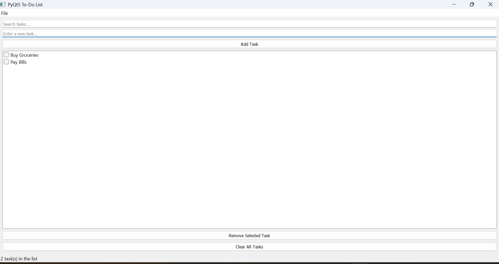

# PyQt5 To-Do List App 📝

A simple yet feature-rich **To-Do List application** built using **Python (PyQt5)**.  
This app allows you to **add, remove, search, and mark tasks as complete**, with persistent storage via JSON.  
It also includes a **dark mode toggle**, a **status bar**, and a **menu bar** for better user experience.

---

## **Features**
- **Add & Remove Tasks** with a single click.
- **Mark Tasks as Completed** using checkboxes.
- **Search Bar** for filtering tasks.
- **Clear All Tasks** button.
- **Persistent Storage** using `tasks.json`.
- **Dark Mode Toggle** for modern UI.
- **Status Bar** showing the total number of tasks.
- **Menu Bar** with `About` and `Exit` options.
- **Custom App Icon (optional)**.

---

## **Preview**


---

## **Installation & Setup**

### **1. Clone the Repository**
```bash
git clone https://github.com/Sreelakshmi-Rameshan/qt-todo-app.git
cd qt-todo-app
```

### **2. Create Virtual Environment (Optional)**
```bash
python -m venv venv
```
Activate it:
- **Windows:** `venv\Scripts\activate`
- **Mac/Linux:** `source venv/bin/activate`

### **3. Install Dependencies**
```bash
pip install -r requirements.txt
```

### **4. Run the App**
```bash
python main.py
```

---

## **Requirements**
- Python 3.7+
- PyQt5 (installed via `requirements.txt`)

---

## **Project Structure**
```
qt_todo_app/
├── main.py               # Main application logic
├── ui/
│   └── main_window.py    # GUI layout (generated or custom code)
├── requirements.txt      # Dependencies
├── tasks.json            # Saved tasks (auto-created)
├── assets/
│   └── icon.png          # App icon (optional)
└── README.md             # Project documentation
```

---

## **Future Improvements**
- Add due dates and reminders for tasks.
- Export tasks to CSV or PDF.
- Multi-language support.
- Build a standalone .exe or .dmg using PyInstaller.

---

## **License**
This project is licensed under the MIT License – see the [LICENSE](LICENSE) file for details.

---
